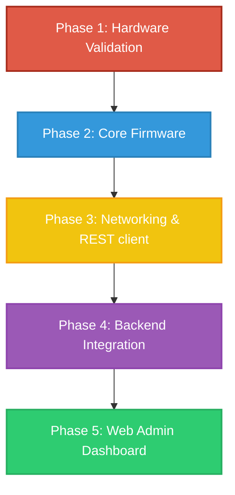

# ESP32 RFID Attendance System

[](https://www.espressif.com/)
[](https://isocpp.org/)
[](https://www.arduino.cc/)
[](LICENSE)
[](docs/development/hardware_validation_log.md)

A professional, modular RFID-based attendance logging system developed on the ESP32 platform. This project is built incrementally, prioritizing clean software engineering principles, clear hardware decoupling, documentation-first validation, and a clear path toward full network synchronization and dashboard analytics.

---

## 📖 Project Overview

The ESP32 RFID Attendance System aims to deliver a resume-quality, robust IoT system. The initial hardware setup features an ESP32 microcontroller, an SPI-based MFRC522 RFID reader, and an I2C-based SSD1306 OLED display. Starting from hardware bring-up and physical verification, this repository will evolve to encompass local caching, encrypted credentials database storage, Wi-Fi networking, a REST API client, and a remote management dashboard.

---

## 💡 Motivation

Embedded systems design in academic and hobbyist settings often relies on copy-paste code and monolithic, unmaintainable Arduino sketches. This project treats the ESP32 platform like a professional IoT node:
- **Clean separation of concerns** between drivers, logic, and networking.
- **Strict state management** using Finite State Machines.
- **Traceability** via hardware logs and changelogs.
- **Scalability** to support enterprise dashboard management in later phases.

---

## 📈 Development Roadmap



1. **Phase 1: Hardware Bring-Up (Current Phase)**
   - Wire standard SPI/I2C buses on breadboard.
   - Run low-level communication tests for SSD1306 and MFRC522.
   - Resolve SPI bus version read register queries.
2. **Phase 2: Local Core Firmware**
   - Design Finite State Machine (FSM) structures.
   - Manage local authorization data and local flash logging.
3. **Phase 3: Wi-Fi & REST Sync**
   - Implement network connectivity with offline cache preservation.
   - Execute secure HTTPS payload transfers.
4. **Phase 4: Database & API Backend**
   - Store entries in centralized databases.
5. **Phase 5: Web Administration Dashboard**
   - Provide administrative registration and real-time logs dashboard.

---

## 🛠️ System Specifications

### Hardware Inventory
- **Microcontroller**: ESP32 Dev Module (WROOM-32 Core)
- **RFID Reader**: MFRC522 (13.56 MHz RFID Transceiver)
- **Display**: SSD1306 OLED (0.96" 128x64 display, I2C interface)
- **Access Credentials**: Mifare Classic 1K RFID cards & key fobs

### Software Stack
- **IDE**: Arduino IDE (bringing up hardware), migrating to **VS Code & PlatformIO** in Phase 2.
- **Core Library Dependencies**:
  - `Adafruit SSD1306` (Display output driver)
  - `Adafruit GFX Library` (Display text rendering engine)
  - `MFRC522` (SPI RFID controller library)

---

## 🏛️ High-Level Architecture

The system utilizes an event-driven loop that separates driver execution from high-level state decisions. Detail specifications are documented in the [System Architecture and Design](file:///d:/Projects/ESP32-RFID-Attendance-System/docs/architecture_and_design.md).

```text
+---------------------------------------------------------+
|                  Application Loop                       |
+---------------------------------------------------------+
                          |
                          v
+---------------------------------------------------------+
|                Finite State Machine                     |
|  (BOOTING -> IDLE -> SCANNING -> VALIDATING -> ALERTS)  |
+---------------------------------------------------------+
        |                                       |
        v                                       v
+-----------------------+               +-----------------+
|   MFRC522 RFID SPI    |               | SSD1306 OLED I2C|
|   Driver Interface    |               |  UI Render Box  |
+-----------------------+               +-----------------+
```

---

## 📂 Directory Layout

```text
ESP32-RFID-Attendance-System/
├── .gitignore                    # Arduino, PlatformIO, VS Code, OS temp files
├── LICENSE                       # MIT License file
├── README.md                     # Main repository documentation entry
├── CHANGELOG.md                  # Project versioning and history tracking
├── firmware/                     # Embedded C/C++ firmware
│   └── attendance_system/
│       └── attendance_system.ino # Main Arduino sketch
├── hardware/                     # Wiring maps and layout schematics
│   └── wiring.md
└── docs/                         # Extended specifications and architectural plans
    ├── architecture_and_design.md
    ├── development/
    │   └── hardware_validation_log.md # Log book detailing active bring-up phase
    └── images/                   # Block diagrams and schematics assets
```

---

## ⚙️ Development Philosophy

- **Modular Design**: Driver specific functions are encapsulated rather than scattered through raw loops.
- **Defensive Programming**: Validate serial bounds, memory buffers, and connection integrity explicitly.
- **Explicit Pin Mapping**: Always map pins inside a unified file ([wiring.md](file:///d:/Projects/ESP32-RFID-Attendance-System/hardware/wiring.md)) to avoid hardcoding pins in code.

---

## 🤝 Contributing

Contributions are welcome! Since this repository is a structured engineering portfolio, please open an Issue to discuss hardware mapping changes, alternative FSM implementations, or custom PCB layout reviews before submitting Pull Requests.

---

## 📜 License

This project is licensed under the [MIT License](LICENSE).
