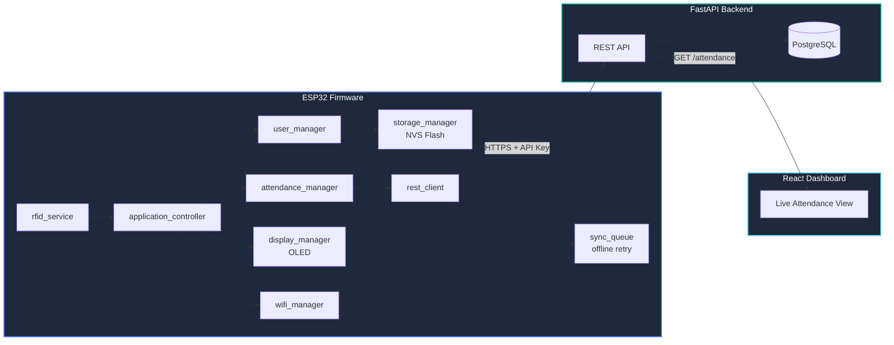

# ESP32 RFID Attendance System

[](https://www.espressif.com/)
[](https://isocpp.org/)
[](https://platformio.org/)
[](https://fastapi.tiangolo.com/)
[](https://www.postgresql.org/)
[](https://react.dev/)
[](LICENSE)

A full-stack IoT attendance platform built around an ESP32 and an MFRC522 RFID reader — from embedded firmware, through an authenticated REST API and PostgreSQL persistence, to a live-updating React dashboard. Built incrementally as a structured engineering exercise: one responsibility per milestone, hardware-verified at every step, security considerations documented throughout rather than bolted on at the end.

**Stack:** ESP32 (C++/PlatformIO) ? FastAPI (Python) ? PostgreSQL ? React (TypeScript/Tailwind)

---

## What it does

A person scans an RFID card. The ESP32 identifies them, marks attendance locally on an OLED display, and syncs the event over WiFi to a backend server — which persists it in PostgreSQL and serves it to a live dashboard that updates automatically, no refresh needed. If the network or backend is unavailable, the device keeps working offline and queues the event for retry once connectivity returns.

An admin card switches the device into registration mode for enrolling new users on the spot, with duplicate-registration and duplicate-attendance safeguards built in at the firmware level.

---

## Key Features

- **Registered user authentication** against an on-device user database, with unknown-card rejection
- **Admin-triggered registration mode** for enrolling new users without reflashing firmware
- **Duplicate prevention** for both attendance marking and user registration
- **Offline-first networking** — WiFi/backend outages don't stop local attendance marking; failed syncs queue in memory and retry automatically once connectivity returns
- **Authenticated REST sync** — attendance events are pushed to the backend over HTTP with a shared API key, not open on the network
- **Persistent attendance history** in PostgreSQL, surviving backend restarts
- **Live dashboard** — auto-refreshing React frontend showing real-time attendance as it happens, with summary stats and a clean data-table view

---

## Architecture


```mermaid
graph LR
    subgraph Firmware [ESP32 Firmware]
        RFID[rfid_service] --> AC[application_controller]
        AC --> UM[user_manager]
        AC --> AM[attendance_manager]
        UM --> SM[storage_manager<br/>NVS Flash]
        AC --> DM[display_manager<br/>OLED]
        AC --> WM[wifi_manager]
        AM --> RC[rest_client]
        RC --> SQ[sync_queue<br/>offline retry]
    end

    RC -->|"HTTPS + API Key"| BE

    subgraph Backend [FastAPI Backend]
        BE[REST API] --> DB[(PostgreSQL)]
    end

    subgraph Dashboard [React Dashboard]
        FE[Live Attendance View]
    end

    BE -->|"GET /attendance"| FE

    style Firmware fill:#1e293b,stroke:#4C6FFF,stroke-width:2px,color:#fff
    style Backend fill:#1e293b,stroke:#009688,stroke-width:2px,color:#fff
    style Dashboard fill:#1e293b,stroke:#61DAFB,stroke-width:2px,color:#fff
```

**Firmware layer** (`firmware/`) — modular embedded C++ on PlatformIO. Each module owns one responsibility: RFID driver, display, persistent storage, user management, attendance logic, WiFi state, REST sync, and an offline retry queue — coordinated by a thin application controller.

**Backend layer** (`backend/`) — FastAPI service with API-key-protected endpoints, backed by PostgreSQL via SQLAlchemy. Runs locally via Docker Compose.

**Frontend layer** (`frontend/`) — React + TypeScript + Tailwind dashboard, session-based API key auth, polling the backend every 10 seconds for live updates.

---

## Quick Start

Requires: PlatformIO (VS Code extension), Python 3.11+, Node.js, Docker Desktop.

**1. Database**
```bash
docker compose up -d
```

**2. Backend**
```bash
cd backend
python -m venv .venv
.venv\Scripts\activate          # Windows
pip install -r requirements.txt
copy .env.example .env          # then fill in API_KEY and Postgres credentials
uvicorn app.main:app --host 0.0.0.0 --port 8000 --reload
```

**3. Dashboard**
```bash
cd frontend
npm install
npm run dev                     # http://localhost:5173
```

**4. Firmware**
```bash
cd firmware/attendance_system
# Copy include/wifi_credentials.h.example -> wifi_credentials.h and fill in your WiFi
# Copy include/backend_config.h.example -> backend_config.h and fill in host/port/API key
pio run --target upload
```

Full setup detail for each layer lives in that component's own README (`backend/README.md`, `frontend/README.md`).

---

## Development Philosophy

This project is built the way a real embedded/software team would build it, not as a single weekend hack:

- **One responsibility per module, one responsibility per commit** — every milestone is isolated, hardware-verified, and independently revertable
- **Build ? Upload ? Hardware Test ? Commit ? Push**, no exceptions — nothing gets committed on "should work," only on confirmed hardware behavior
- **Security considered at every layer, not just claimed** — see [`docs/security_considerations.md`](docs/security_considerations.md) for an honest, running log of what's protected, what isn't yet, and why
- **Defensive, explicit code** — no hardcoded pins, no magic numbers, credentials and secrets kept out of git via `.gitignore`'d local config files with committed `.example` templates

---

## Security Notes

This is a local-network hobby/portfolio project, not a production security product — and the README says so honestly rather than overclaiming. Known, documented limitations include: RFID UID cloning is not mitigated at the hardware level, the REST API uses a static shared key rather than per-device credentials, and traffic is plain HTTP rather than TLS. Full details and reasoning in [`docs/security_considerations.md`](docs/security_considerations.md) — treating this as a living document was a deliberate practice throughout the build, not an afterthought.

---

## System Specifications

**Hardware:** ESP32 Dev Module (WROOM-32) · MFRC522 RFID reader (13.56 MHz, SPI) · SSD1306 OLED (0.96", I2C) · Mifare Classic 1K cards/fobs

**Firmware:** C++ / Arduino framework / PlatformIO — `MFRC522`, `Adafruit SSD1306`, `Adafruit GFX Library`

**Backend:** Python / FastAPI / SQLAlchemy / PostgreSQL 16 (Docker) / python-dotenv

**Frontend:** React / TypeScript / Vite / Tailwind CSS

---

## Directory Layout

```text
ESP32-RFID-Attendance-System/
+-- firmware/attendance_system/     # ESP32 embedded firmware (PlatformIO)
¦   +-- include/                    # Module headers
¦   +-- src/                        # Module implementations
+-- backend/                        # FastAPI REST API + PostgreSQL models
¦   +-- app/
¦       +-- routes/                 # /health, /attendance
¦       +-- auth.py                 # API-key verification
¦       +-- database.py             # SQLAlchemy engine/session
¦       +-- db_models.py            # AttendanceEvent table
+-- frontend/                       # React dashboard
¦   +-- src/
+-- hardware/                       # Wiring reference
+-- docs/                           # Architecture notes, security log, validation log
+-- docker-compose.yml              # Local PostgreSQL
+-- CHANGELOG.md
```

---

## Development Roadmap

- [x] Modular embedded firmware (display, storage, RFID, user, attendance, application controller)
- [x] Persistent on-device storage (NVS)
- [x] Admin mode, dynamic registration, duplicate prevention
- [x] WiFi connectivity with graceful offline fallback
- [x] REST API client with offline sync queue
- [x] Authenticated FastAPI backend
- [x] PostgreSQL-backed persistent attendance history
- [x] Live React dashboard
- [ ] Face recognition as a secondary authentication method (planned)

---

## Contributing

This repository is a structured engineering portfolio. Open an issue to discuss hardware mapping changes, architectural alternatives, or improvements before submitting a pull request.

---

## License

[MIT License](LICENSE)
