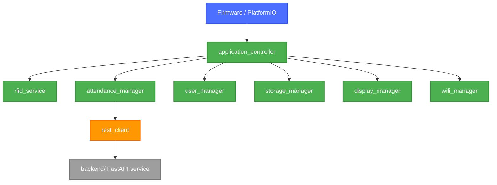

# ESP32 RFID Attendance System

[](https://www.espressif.com/)
[](https://isocpp.org/)
[](https://platformio.org/)
[](LICENSE)
[](docs/development/hardware_validation_log.md)

A professional, modular RFID-based attendance logging system developed on the ESP32 platform. This project is built incrementally, prioritizing clean software engineering principles, clear hardware decoupling, documentation-first validation, and a clear path toward backend synchronization and dashboard analytics.

---

## Project Overview

The ESP32 RFID Attendance System aims to deliver a resume-quality, robust IoT system. The initial hardware setup features an ESP32 microcontroller, an SPI-based MFRC522 RFID reader, and an I2C-based SSD1306 OLED display. The repository now contains both `firmware/` for the embedded PlatformIO project and `backend/` for the FastAPI attendance service used during local-network testing. Current firmware work spans local storage, Wi-Fi connectivity, and an additive REST API client that syncs attendance events without changing the local marking flow.

### Key Features
- Registered user authentication against an internal user database.
- Unknown card rejection to prevent unauthorized logging.
- OLED user feedback with personalized greeting and attendance status.
- Local-only REST synchronization when Wi-Fi and the backend are available.
- Attendance sync endpoints are protected by a shared `X-API-Key` between the firmware and backend.
- Attendance history is now persisted in PostgreSQL on the backend.

---

## Motivation

Embedded systems design in academic and hobbyist settings often relies on copy-paste code and monolithic, unmaintainable Arduino sketches. This project treats the ESP32 platform like a professional IoT node:
- Clean separation of concerns between drivers, logic, and networking.
- Strict state management using finite state machines.
- Traceability via hardware logs and changelogs.
- Scalability toward a future dashboard-backed workflow.

---

## Development Roadmap

- [x] Repository Scaffold
- [x] Hardware Validation
- [x] System Boot Sequence
- [x] RFID Service
- [x] Application Controller
- [x] User Management
- [x] Duplicate Attendance Prevention
- [x] Admin Mode
- [x] Dynamic User Registration
- [x] Duplicate User Registration Prevention
- [x] Persistent User Storage
- [x] Attendance Session Manager
- [x] Wi-Fi Synchronization
- [x] Backend API (API-key Auth)
- [x] REST API Client
- [ ] Attendance Logs
- [ ] Web Dashboard

---

## Current Architecture


```mermaid
graph TD
    FW[Firmware / PlatformIO] --> AC[application_controller]
    AC --> RFID[rfid_service]
    AC --> AM[attendance_manager]
    AC --> UM[user_manager]
    AC --> SM[storage_manager]
    AC --> DM[display_manager]
    AC --> WM[wifi_manager]
    AM --> RC[rest_client]
    RC --> BE[backend/ FastAPI service]

    style FW fill:#4C6FFF,stroke:#2F4FD4,stroke-width:2px,color:#fff
    style AC fill:#4CAF50,stroke:#388E3C,stroke-width:2px,color:#fff
    style RFID fill:#4CAF50,stroke:#388E3C,stroke-width:2px,color:#fff
    style AM fill:#4CAF50,stroke:#388E3C,stroke-width:2px,color:#fff
    style UM fill:#4CAF50,stroke:#388E3C,stroke-width:2px,color:#fff
    style SM fill:#4CAF50,stroke:#388E3C,stroke-width:2px,color:#fff
    style DM fill:#4CAF50,stroke:#388E3C,stroke-width:2px,color:#fff
    style WM fill:#4CAF50,stroke:#388E3C,stroke-width:2px,color:#fff
    style RC fill:#FF9800,stroke:#EF6C00,stroke-width:2px,color:#fff
    style BE fill:#9E9E9E,stroke:#757575,stroke-width:2px,color:#fff
```

This modular pipeline establishes that:
1. `application_controller` coordinates boot and scan-time state transitions.
2. `rfid_service` handles card detection and UID extraction.
3. `attendance_manager` owns local attendance marking and the additive REST sync call.
4. `user_manager` handles lookup and registration of users.
5. `storage_manager` persists user records in ESP32 non-volatile storage.
6. `display_manager` renders the user-facing OLED messages.
7. `wifi_manager` manages connection state and exposes `isWiFiConnected()`.
8. `rest_client` POSTs attendance events to the FastAPI backend when Wi-Fi is available.
9. `backend/` is a sibling FastAPI component used for local-network attendance testing and future expansion.

---

## System Specifications

### Hardware Inventory
- Microcontroller: ESP32 Dev Module (WROOM-32 Core)
- RFID Reader: MFRC522 (13.56 MHz RFID transceiver)
- Display: SSD1306 OLED (0.96" 128x64 display, I2C interface)
- Access Credentials: Mifare Classic 1K RFID cards and key fobs

### Software Stack
- IDE / Build System: VS Code and PlatformIO
- Framework: Arduino ESP32 Framework
- Core Library Dependencies:
  - `Adafruit SSD1306`
  - `Adafruit GFX Library`
  - `MFRC522`

---

## Development Environment

Development is now performed using PlatformIO with Visual Studio Code.

- PlatformIO
- ESP32 Dev Module
- Arduino Framework

Firmware configuration files are kept as local copies of example files:

- Copy `firmware/attendance_system/include/wifi_credentials.h.example` to `wifi_credentials.h`
- Copy `firmware/attendance_system/include/backend_config.h.example` to `backend_config.h`
- Set the Wi-Fi credentials, backend host, backend port, and shared API key locally before building

Required libraries:

- MFRC522
- Adafruit SSD1306
- Adafruit GFX Library

---

## High-Level Architecture

The system uses an event-driven loop that separates driver execution from high-level state decisions. Detail specifications are documented in [docs/architecture_and_design.md](docs/architecture_and_design.md).

```text
+---------------------------------------------------------+
|                  Application Loop                       |
+---------------------------------------------------------+
                           |
                           v
+---------------------------------------------------------+
|                Finite State Machine                     |
|  (BOOTING -> IDLE -> SCANNING -> VALIDATING -> ALERTS)  |
+---------------------------------------------------------+
        |                                       |
        v                                       v
+-----------------------+               +-----------------+
|   MFRC522 RFID SPI    |               | SSD1306 OLED I2C|
|   Driver Interface    |               |  UI Render Box  |
+-----------------------+               +-----------------+
```

---

## Directory Layout

```text
ESP32-RFID-Attendance-System/
├── .gitignore
├── LICENSE
├── README.md
├── CHANGELOG.md
├── backend/
│   ├── .env.example
│   ├── README.md
│   ├── requirements.txt
│   └── app/
│       ├── __init__.py
│       ├── auth.py
│       ├── config.py
│       ├── main.py
│       ├── models.py
│       └── routes/
│           ├── __init__.py
│           ├── attendance.py
│           └── health.py
├── firmware/
│   └── attendance_system/
│       ├── platformio.ini
│       ├── include/
│       │   ├── application_controller.h
│       │   ├── attendance_manager.h
│       │   ├── backend_config.h.example
│       │   ├── display_manager.h
│       │   ├── rest_client.h
│       │   ├── rfid_service.h
│       │   ├── storage_manager.h
│       │   ├── user_manager.h
│       │   ├── wifi_credentials.h.example
│       │   └── wifi_manager.h
│       └── src/
│           ├── application_controller.cpp
│           ├── attendance_manager.cpp
│           ├── display_manager.cpp
│           ├── main.cpp
│           ├── rest_client.cpp
│           ├── rfid_service.cpp
│           ├── storage_manager.cpp
│           ├── user_manager.cpp
│           └── wifi_manager.cpp
├── hardware/
│   └── wiring.md
└── docs/
    ├── architecture_and_design.md
    ├── development/
    │   └── hardware_validation_log.md
    └── security_considerations.md
```

---

## Development Philosophy

- Modular design: driver-specific functions are encapsulated rather than scattered through raw loops.
- Defensive programming: validate serial bounds, memory buffers, and connection integrity explicitly.
- Explicit pin mapping: always map pins inside a unified file to avoid hardcoding pins in code.

---

## Contributing

Contributions are welcome. Since this repository is a structured engineering portfolio, please open an Issue to discuss hardware mapping changes, alternative FSM implementations, or custom PCB layout reviews before submitting Pull Requests.

---

## License

This project is licensed under the [MIT License](LICENSE).

